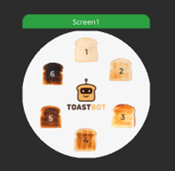

# 🥯 ToastBot

**ToastBot** is an intelligent toaster system that uses real-time color sensing, adaptive control, and a custom user interface to deliver perfectly browned toast, every time. This project was developed as part of an engineering capstone project.


---

### 🍞 What it Does
- Monitors toast browning using APDS-9960 RGB color sensors
- Converts RGB to L\*a\*b\* color space and compares against user-defined shade targets
- Dynamically adjusts heating power between 100%, 80%, and 60% based on a model of browning behavior
- Uses an electromagnet-based pop-up mechanism to release toast when the target shade is reached
- Provides a rotary-dial interface via M5Dial for shade selection and feedback

---

## 🗂️ File Structure

```
ToastBot/
├── Arduino/ # Firmware for color sensing, heating control, and electromagnet release
├── Controls/ # Python control algorithm that adjusts power in real time based on color feedback
├── UI/ # M5Dial (ESP32) user interface for selecting toast shade and displaying status
├── README.md
```

---

## 🔌 Components

### Arduino
- Communicates with APDS-9960 sensors through I2C multiplexer
- Reads RGB values, converts to L\*a\*b\*, and sends data to Python controller
- Controls heater and toast-ready pin (electromagnet)

### Controls
- Python-based adaptive algorithm that:
  - Tracks browning phase (goldening → browning)
  - Predicts expected R-values using empirical equations
  - Adjusts power in real time based on sensor error
  - Logs data for analysis and visualization

### UI

- ESP32-based M5Dial interface
- Lets users choose from 6 toast shades (very light → very dark)
- Sends shade selection to Arduino via I2C
- Displays toast progress and completion status

---


